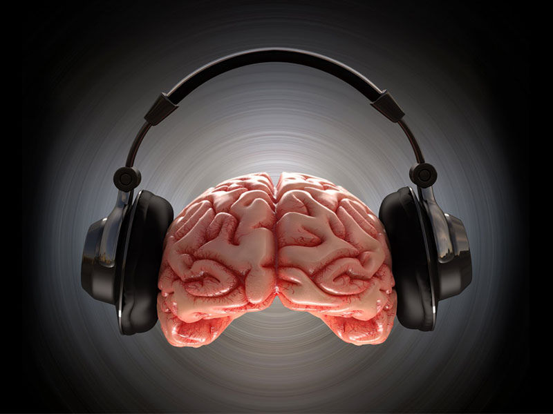
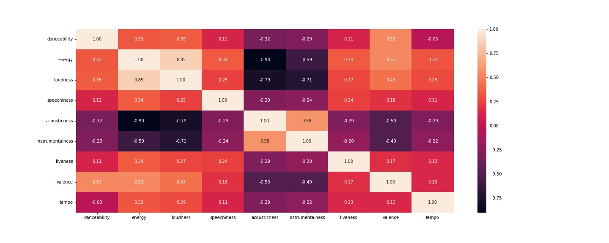
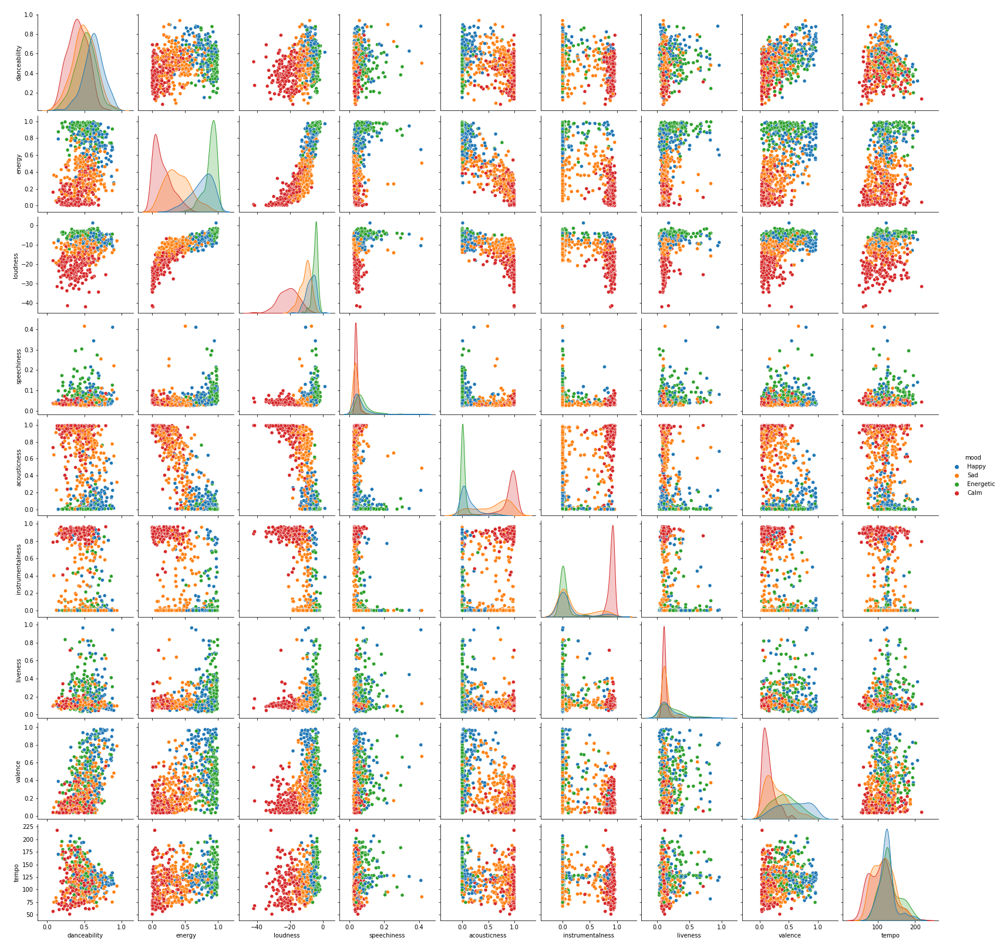

# Music Oracle

## 📝 Project Overview
Besides being a medium for entertainment, music is an incredible and powerful language that allows us to express our emotions and feelings. In some cases, music can prove to be efficient on a therapeutic level, especially in particular moments of our life. As emotions and moods can easily be reflected in music, we all try to use it in every moment of our daily life based on our current state of mind, whether we are looking for a stimulant or comfort to calm us down, to sleep, or for sport. The combination of all these aspects is, in fact, the reason why we decided to find a classification model able to help us determine the type of mood of a song. 
For our project, we expose and explain how we could achieve the prediction using a Kaggle's Dataset provided from Spotify and a Multi-Class Neural Network for Classification.

Find more about music mood classification <a href="https://sites.tufts.edu/eeseniordesignhandbook/2015/music-mood-classification/">here</a> 

## ETL process
### In the transfromation.ipynb file <a href="https://github.com/radoo945/Ushuaia-4/blob/main/transformation.ipynb">Click here</a> 
1. After downloading our two files from Kaggle, we imported them into jupyter notebook and created data frames using pandas.
Subsequently, we performed a cleaning procedure involving identifying data errors and removing columns not used in our analysis; we also eliminated any empty cells. This phase aims to improve the quality of the data and to have more accurate, consistent and reliable information for the continuation of the project.

2. After transforming the data, using SQL Alchemy, we built a connection between Jupyter notebook and PostgreSQL, where we had previously created a database and two tables to hold our data.
The choice of Postgres was because our two tables have a comune column for which a relational database was ideal.

## Data analysis
### In the Analysis.ipynb file <a href ="https://github.com/radoo945/Ushuaia-4/blob/main/analysis.ipynb"> Click here</a>

1. In this part of our project, we selected nine features from our dataset to conduct our analysis on Spotify music and displayed a statistic summary to summarise and provide a gist of information about our dataset. 
We then displayed the correlations between each selected feature which led us to plot our data's heatmap.

      * In the heatmap, the positive value means that the two attributes have positive correlation between them
      * The colors are darker or lighter based on the correletion value inside our interval (-1,1). 
2. We then used Seaborn Pairplot that allows us to plot pairwise relationships between our selected features with the track mood. This creates a nice visualisation and helps us understand the data by summarising a large amount of data in a single figure. This is essential when we are exploring our dataset and trying to become familiar with it. In the figure, we can see all our variables shown along the y and x axis. Along the diagonal we have a kernel density estimate(KDE) showing the clustering of each of the variables considering the mood.  

3. We also displayed an histogram of each selected features showing the distrubition of the selected features

4. The word cloud below displays the artists based on their popularity. We were able to create this visualisation by converting our original  
DataFrame into a dictionary. The size of the names reflects the frequency they appear in the dataset.

## Tableau visualization
With tableau, se created few visualizations highlighting certain charateristics of our dataset. We managed to vizualise patterns such as:
* The top 10 popular artists
* The top popular songs
* Acousticness track count and percentage per mood
* Danceability track count and percentage per mood
* Amount of tracks per decade of release considering the mood
* Top 10 popular track per mood

Click the link to see the tableau workbook 
https://public.tableau.com/app/profile/kouam.kouassi/viz/My_song_oracle/top10populartrackpermood

## Prediction Process
### In the Prediction.ipynb file <a href ="https://github.com/radoo945/Ushuaia-4/blob/main/prediction.ipynb">Click here</a>
This file contains our machine learning and neural network models applied in the song mood prediction.

The project's ultimate goal is to predict the mood of the songs by creating a process thanks to machine learning and neural network.
For this purpose, we have conducted this pre-processing process:

#### Machine learning

* We normalized our selected categories using the MinMaxScaler to scale the values in a range of [0,1] while preserving the constitution of the initial data.
* We encoded our four mood categories because machine learning and neural network use numerical values to train and test.
*  We split the data by 80% for training and 20% for testing.
* We used Multi Class Classification Models "K-NN, Decision tree, random forest, Extremely Random trees, Boosting" to evaluate the accuracy of the dataset we are using for the mood prediction.
* From the values of the test and train scores obtained from our two models, we observed that random forest model scores are higher than the scores obtained with the logistic regression model

#### Neural Network

* We used the library Keras to enable fast experimentation with Deep Neural Networks.
* Our main goal is to classify tracks in the 4 categories of moods (Calm, Energetic, Happy and Sad), so my model consists of a Multi-Class Neural Network with an input of 10 Features, 1 Layer with 8 nodes, and 4 outputs with the output Layer.
* KerasClassifier is used as estimator in this case  
* We then evaluated the NN model using K-Fold Cross Validation, with which we evaluated our estimator using the train data.
* It is important to note that in this phase, the K = 10 is the number of splits of the mixed values.
* We evaluate the accuracy of the Multi-class neural network by building a confusion matrix using the Seaborn library and Matplotlib.
* With a Final Accuracy score of 77% and looking at the Confusion Matrix, our model is good at classifying Calm and Sad songs. However, we had some issues dealing with Happy songs, while energetic songs are quite well classified.
* The project can be improved by modifying parameters such as the epochs and eliminating some track features.

## 📚 Dataset Sources:

* https://www.kaggle.com/datasets/musicblogger/spotify-music-data-to-identify-the-moods

# Ptoject-4-Ushuaia
